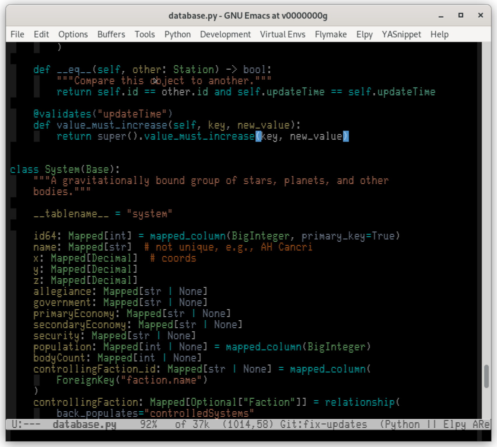

[![melpa badge][melpa-badge]][melpa-link]
[![melpa stable badge][melpa-stable-badge]][melpa-stable-link]

# glass-tty-theme

`glass-tty-theme` is a reverse video-like Emacs color theme for use
with [the Glass TTY VT220 font](https://caglrc.cc/~svo/glasstty/).
The theme is available on [MELPA](https://melpa.org/) and
[MELPA stable](https://stable.melpa.org/).  Install it on Emacs 24 or
newer with the following command:

<kbd>M-x package-install [RET] glass-tty-theme [RET]</kbd>

Add
`"f1464b61b06a9bb9082399e3dcb640758a2daf9f2a09ef816c7d290a997864d4"`
to `custom-safe-themes` before loading the theme with the following
command:

<kbd>M-x load-theme [RET] glass-tty [RET]</kbd>

[melpa-link]: https://melpa.org/#/glass-tty-theme
[melpa-stable-link]: https://stable.melpa.org/#/glass-tty-theme
[melpa-badge]: https://melpa.org/packages/glass-tty-theme-badge.svg
[melpa-stable-badge]: https://stable.melpa.org/packages/glass-tty-theme-badge.svg
